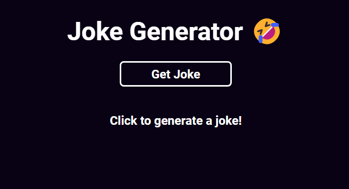

# React - Joke Generator

Simple **Joke Generator** to put in practice some initials studies in React.

*Jokes from <a href="https://icanhazdadjoke.com/">icanhazdadjoke</a> API*

<p align="center"></p>

## Getting Started 

**1- Clone this repository:**
```bash
git clone https://github.com/luizfranzon/React-JokeGenerator.git
```
**2- Install dependencies:**
```bash
npm install
```
**3- Run the project:**
```bash
npm run dev
```